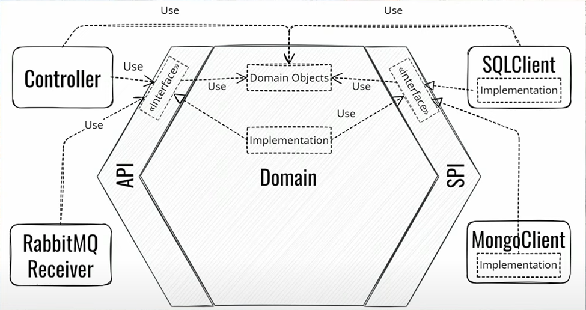

# Hexagonal Architecture User Management System

## Project Goal

The goal of this project is to implement a **User Management System** using **Hexagonal Architecture** (also known as **Ports & Adapters**). The system provides a structured way to manage users and their details efficiently.

## What is Hexagonal Architecture?

Hexagonal Architecture is a design pattern that separates **business logic** from external dependencies like databases, APIs, or user interfaces. It promotes maintainability, testability, and scalability by organizing code into three layers:


- **Domain Layer**: Core business logic.
- **Application Layer**: Handles API requests and service logic.
- **Infrastructure Layer**: Contains database persistence, adapters, and external service integrations.

## Technologies Used

- **Spring Boot** - For building the RESTful API.
- **Spring Data JPA** - For database interaction.
- **Hibernate** - ORM for managing entities.
- **PostgreSQL** - Database used for persisting user data.
- **ModelMapper** - For object mapping between entity and DTO.
- **Lombok** - To reduce boilerplate code.
- **Maven** - For project dependency management.

## Architecture Overview

This project follows **Hexagonal Architecture**, which divides the application into:

- **Domain Layer (Core Business Logic)**
- **Application Layer (REST API Services & Use Cases)**
- **Infrastructure Layer (Adapters, Persistence, External Services, etc.)**

## Entity Relationships

The system consists of two main entities: **User** and **UserDetails**.

## API Endpoints

| Method   | Endpoint       | Description                       |
| -------- | -------------- | --------------------------------- |
| `POST`   | `/user`        | Register a new user               |
| `GET`    | `/users`       | Retrieve all users                |
| `GET`    | `/users/{id}`  | Retrieve user by ID               |
| `PUT`    | `/users/{id}`  | Update user details               |
| `DELETE` | `/users/{id}`  | Soft delete a user                |

## How to Run the Project

### **1. Clone the Repository**

```sh
git clone https://github.com/ZayoutaBilal/Hexagonal-Architecture-Spring-Boot.git
```

### **2. Configure Database**

Modify `application.properties`:

```properties
spring.datasource.url=jdbc:postgresql://localhost:5432/your_db
spring.datasource.username=your_username
spring.datasource.password=your_password
spring.jpa.hibernate.ddl-auto=update
```

### **3. Run the Backend**

```sh
mvn clean install
mvn spring-boot:run
```

